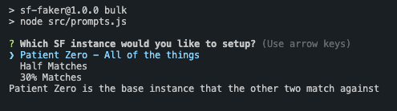
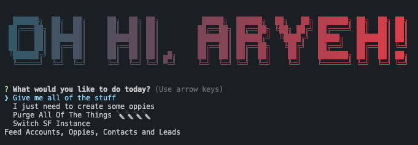

# SF Faker
A simple node app to generate real-ish data in your dev salesforce instance(s). It uses the [faker api](https://fakerjs.dev/) to generate accounts, contacts, leads and opportunities. By default, it creates 300 accounts, 1 - 2 opportunities on each account, 1 - 2 contacts on each account. Closed Won or Closed Lost stages are assigned a past close date and all other stages are assigned a random future date within 2 years. 

This tool uses three accounts to create predictable overlaps between accounts. 
1. Patient Zero: This is the main source of truth. Accounts two and three match against this one. 
2. Fifty: matches 50% to Patient Zero
3. Thirty: matches 30% to Patient Zero (and 60% to the Fifty account)

## Requirements
1. [sfdx](https://developer.salesforce.com/tools/salesforcecli) (salesforce cli tool)
2. node >= v20

## Pre-Requisites
The below steps are a little annoying / tedious, but they are important. It allows you to bulk delete all of the data in the instances and control the opportunity open date. The bulk deletion functionality is important because it allows you to never have to wire up another dev instance again. You can keep using these three!
1. Make three [SF dev instances](https://developer.salesforce.com/signup). **Give each account a descriptive email for matching functionality**: 
   1. account 1 (full matching): aryeh+full@crossbeam.com
   2. account 2 (50% matching to account 1): aryeh+fifty@crossbeam.com
   3. account 3 (30% matching to account 1): aryeh+thirty@crossbeam.com
2. For each SF Dev instance, [follow these steps](https://www.notion.so/crossbeam-internal/Setting-Up-Salesforce-for-Dev-8ef8024f9d0840f0bd8065669dbfbf91) to allow bulk deletion and mutating of opportunity open dates

## Using the tool
```
npm run bulk
```
Choose which account you would like to address



Follow the SF auth steps after entering in your email associated with the account



Options:
- *Give me all of the stuff*: seeds accounts, oppies, contacts and leads
- *I just need to create some oppies*: feed *n* oppies between a start and end date
- *Purge All Of The Things 🔪🔪🔪🔪*: hard delete of Accounts, Leads, Cases, Opportunities and Contacts
- *Switch SF Instance*: switch to another SF account